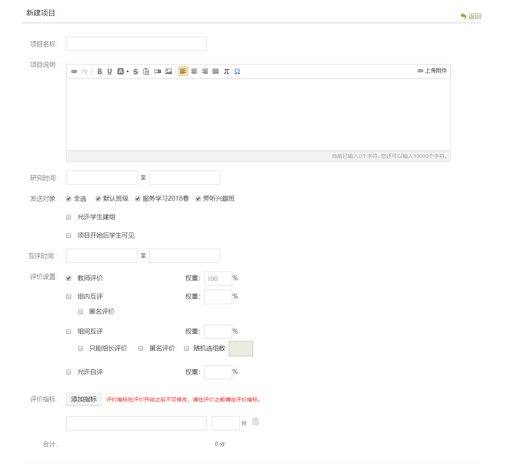

# 基于PBL的学习平台

## 1、开发任务概述

### 1.1 开发目标

PBL（Project-Based Learning，项目式学习）是一种教学方法，即学生通过一段时间内对真实的、复杂的问题进行探究，并从中获得知识和技能。

PBL System该系统结合项目是学习的有关研究，将项目与课程相结合，学生通过在线课程学习，自由组队，并从感兴趣的项目出发，而不只是单调的听课，来激发学习兴趣，并锻炼动手能力、团队协作能力。

本项目的开发目标是结合PBL思想开发一个类似超星的学习平台，具体的功能定义见part2。与project_blockly和project_web3D不同的是，此项目重点在平台设计和后端，同学们可以酌情选择。

### 1.2 条件和约束

#### 1.2.1 前提约束

**不得抄袭，被发现后果自负。**

允许借鉴与学习开源项目与材料。

#### 1.2.2 依赖条件

能够熟练编写HTML、CSS、JavaScript，掌握JSON和RESTful的基础应用，对JavaEE基础架构、Spring Boot、MyBatis、数据库设计有一定的认识。并对课程中涉及的其他Web技术有一定的基础和了解。

技术范围：

* Web基础课程的知识（HTML，CSS，JavaScript），AJAX技术。
* 前端采用Angular组件开发
* 后端采用Spring Boot框架，MyBatis作数据库持久化层，数据库不限制，MySQL、MongoDB或者图数据库如Neo4j
* 采用前后端分离的架构，后端开发出RESTful的API风格，给前端调用，前后端之间用JSON或者XML格式传递数据。
* 前端与后端的程序均部署在云服务器上，在线上环境直接演示。

## 2. 系统基本功能与流程

### 2.1 系统角色

| 角色名称   | 职责描述                                                     |
| ---------- | ------------------------------------------------------------ |
| 老师       | 开设课程，设立项目，发布任务，设立评分标准，对学生进行评分。 |
| 学生       | 加入课程，并选择该课程下感兴趣的项目进行组队，默认为选择同一个项目的同学为一个小组；分为组长和组员，组长对项目进行规划，布置任务，监督完成情况；组员可查看项目任务，标记完成情况；学生互评。 |
| 后台管理员 | 对系统的用户、课程、项目进行增删改查。                       |

### 2.1 功能要求

#### 2.1.1 基本功能

- 注册和登录
    - 注册（仅学生需要注册，老师由管理员添加）
    - 登录
    
- 个人资料管理
  
    - 添加/修改/删除个人信息
    - 上传头像
    
- 课程管理（仅老师）

    课程和下面提到的项目、任务的关系是：一门课程可以包含多个项目，一个项目可以包含多个任务。

    - 仅老师可以增删课程，学生可以查看课程；课程发布后，不可修改。

- 项目管理（核心功能）
  
    项目可以理解成任务的集合，一个项目中包含多个任务，学生需要在规定时间内完成。项目和任务的展示效果自定义，可以是卡片式，也可以是日历式。每个任务应该有自己的开始日期、截至日期和重要程度等信息。加入同一个项目的学生自动归类为一组，分为组长和组员，组长的选取方法自定。组长可以对完成项目进行规划，并布置任务，监督完成情况；
    
    - 添加/删除项目（仅老师）
    - 加入和查看项目（学生）
    - 添加和查看任务（组长或老师）
    - 查看组员每个任务点的完成情况（组长和老师）
    - 标记完成任务（学生）
    - 讨论（学生和老师都可以提问、互动）
    - 文件管理。每个项目有自己的文件空间，可以让学生，老师自由发布文件。
        - 上传文件
        - 下载文件
        - 删除文件
    
- 评分。
  
  - 老师为项目中的学生评分，老师打分时，应显示相应的参考数据，比如任务完成情况，讨论板留言内容等。
  - 学生查看老师对自己的各项评分
  
- 用户管理
  
    - 增删查改（仅管理员）。管理员可以添加任何用户，其中老师用户只能由管理员添加。进阶功能：管理员可以进行细致的、图形化的权限管理。
    
- 系统部署在云服务器上，提供可以访问的公网地址。

#### 2.1.2 进阶功能

- 参考网站[TeamGantt](https://www.teamgantt.com/)用甘特图的方式展示任务，可以按不同的时间维度查看，比如月、周、日。
- 针对打分功能进行细化。
  - 包括老师可以进行更细分的打分设定；比如允许小组内部学生互评；允许自评等，相应的设定背后要有相应的实现。

### 2.2 性能需求

除了功能需求外，学习平台还在以下几个方面有一定的需求：

* 易用性：为便于师生群体使用本系统，其应在界面和功能上做到清晰易懂，降低新用户的学习成本。
* 高可拓展性：本系统应允许便捷地新增功能。系统应将功能拆解为不同的逻辑模块，并允许将模块便捷地装载至系统中。
* 高可用性：为了便于本系统稳定地提供服务，其在架构设计上应采用容错性高的方案，尽量减少单点失败造成服务不可用的概率。

## 3.系统说明

### 3.1 业务架构图

**

### 3.2 参考资料

- 一个基于Spring Boot & MyBatis的[种子项目](https://github.com/lihengming/spring-boot-api-project-seed)，用于快速构建中小型API
- 采用前后端分离架构，Angular8前端客户端和Spring Boot后端服务器实现CRUD的简单案例，作为初始的[demo](https://grokonez.com/spring-framework/spring-boot/spring-boot-angular-8-example-crud-mysql-spring-restapis-angular-http-client-tutorial)供大家学习。

### 3.3 参考截图

给出部分关键功能截图为同学们提供灵感。动手开发时不要求与demo完全相同。

##### 不同的课程供学生查看

进入课程后可以查看已有的项目并选择加入

##### 加入项目后，在项目页可以查看小组成员、任务、讨论板等

##### 任务页展示已有任务，支持学生发布任务

**教师评分设定页**

可以在开设项目的时候设定。如果只是完成基本的评分功能，可以不用有这么多设置。

## 4. 评分细则 

### 4.1 分数组成

- 基本功能分:即完成系统基本内容与流程，满分 110 分。 
- 进阶任务分:包括但不限于更精致的设计、场景，更好的开发部署流程、设计模式等。最多 20 分。 
- 个人工作分:根据小组分工及个人完成工作量得分。每组组员该项分数总和 30 分，根据贡献比例分摊。

个人最终得分 = 基本功能分 + 进阶任务分 + 个人工作分，值域为 [0, 160]。 

### 4.2 评分点

|功能项 | 得分项 | 最高分数|
| ------ | ------ | ------ |
|总体UI和交互（20分） | 总体界面美观、舒适 | 10 |
| | 总体交互体验流畅合理，菜单和返回正常使用 | 10 |
| 基本流程（10分） |注册和登录页面| 5 |
|| 个人资料管理 |5|
|功能细分（45分） | 项目的增删查                                     |5|
||任务的发布、删除、标记完成、查看| 5 |
||任务的查看页面（美观、直观程度）| 5 |
||组长和老师查看每个任务点的完成情况，并可以督促| 10 |
||讨论板| 5 |
|| 文件管理                                         |5|
|| 管理员的用户管理                                 |5|
|| 评分功能（包括老师的打分和学生查看） |5|
|工程能力（25分）| 文档（详实准确） |10|
|| 系统架构（验证登录、权限管理、复用性等） |10|
||代码风格（代码整洁、注释完整，设计模式等）| 5|
|项目部署（10分）|将服务器部署到公有云上 |5|
||使用Docker部署 |5|
|进阶功能 |在任务查看中引入甘特图，可以按不同的时间维度查看| 15 |
| |管理员可以利用图形化的方式进行权限管理| 10 |
| |评分功能细化| 10 |
||其他合理亮眼的附加功能 |15|

### 4.3 评分点说明

1. 每一项的分数取决于该项功能的完成度。完成度和可用性越好，分数越高。 

2. 项目完整度和易用性评价标准:

- A. 功能残缺，不能完整运行，有明显bug

- B. 完成规定的用户功能和操作，无明显瑕疵

- C. 界面舒适，操作合理，响应迅速，鲁棒性强

  A、B、C 分别对应 分数的0 - 30% ，30% - 70% 分，70% - 100% 分。

3. 附加功能必须在文档中明确写出，概述该功能并描述实现原理。 

4. 项目设计文档需要至少包含:
    - 项目组织以及其中每个文件的说明。
    - 关键功能实现的细节。
    - 服务器部署配置的详细介绍。

5. 团队分工文档需要至少包含: 
    - 团队成员、分工、具体完成工作，列出每个人的贡献比例。
    - 其他你们想说明的问题。 
    
## 5. 提交

1. 提交物包含以下三项:
    - **源代码**：推荐使用 Git 进行协作，提交到 GitHub 等 Git 托管平台上。 
    - **文档**：推荐使用 Markdown 编写项目文档，与源代码一同提交到 Git 托管平台上。 
    - **可供访问的公网地址**，以及系统的操作说明(玩法)。
2. 提交物需要压缩打包提交到 FTP 上，文件名中请包含小队所有成员的姓名与学号。 

3. 友情提示：请尽早开工，本学期只有一个 Project，临时赶工很有可能完不成。
